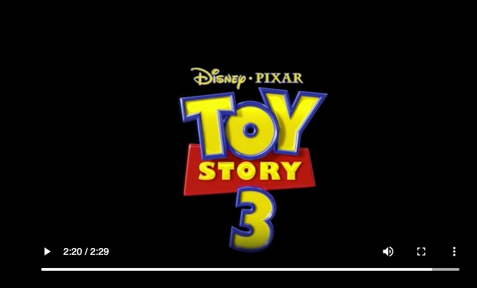

# spring-boot-video-streaming

Repository contains the code to stream the video in HTTP. Used the
Spring framework to Stream the Video

      Url endpoint is video/stream/mp4/toystory
      Here the Path params are video/stream/{fileType}/{fileName}
      
      Applicaiton looks for the video in the resources/video folder, if want to
      work on own video, place the file in video folder in resources and 
      play around it.
      
      Start the applciation and hit the below url to try it out
      http://localhost:8081/video/stream/mp4/toystory

### Image Screen shot

Toy Story 3

